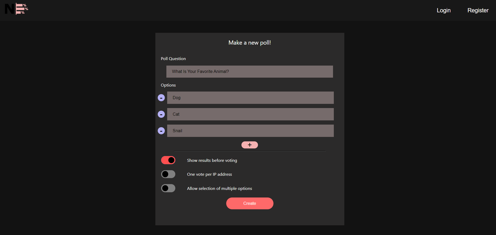
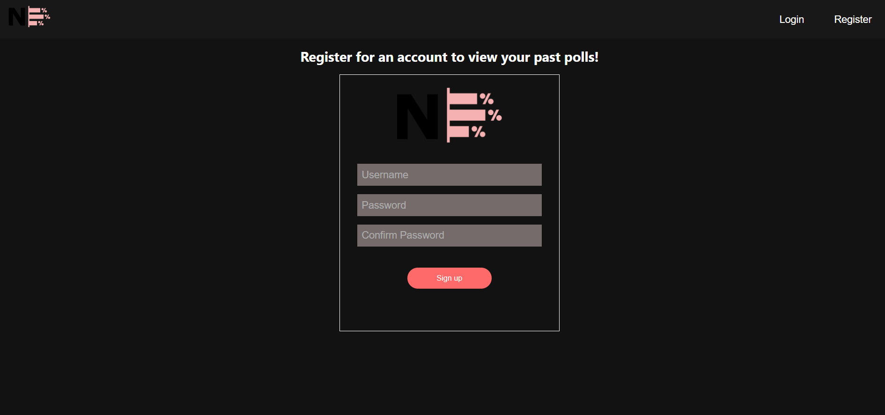
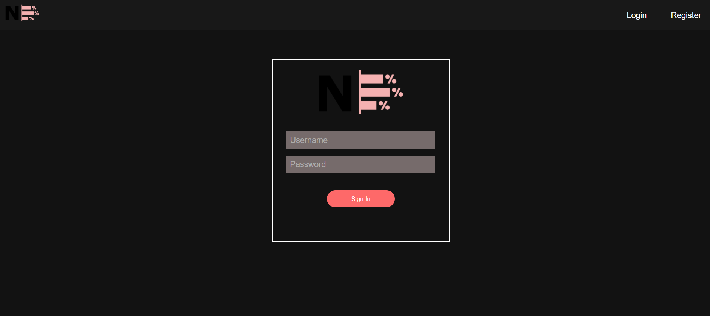

# NewPoll

## Description

NewPoll is a website that allows for the creation and management of polls

## Installation and Deployment

### Front-end

* Navigate to the `client` folder
* ```npm install```
* ```npm start```

### Back-end

* Navigate to the `server` folder
* ```npm install```
* ```npx nodemon index.js```

Navigate to `https://localhost:3000` in your web browser of choice to access a local instance of NewPoll.

## Demo

### Homepage / Poll Creation



### Register



### Login



## Development

Built with MERN stack

* [![Mongodb][Mongodb.js]][Mongodb-url]
* [![Express][Express.js]][Express-url]
* [![React][React.js]][React-url]
* [![Node.js][Node.js]][Node-url]

## Roadmap

* [x] Add Register / Login Functionality
* [x] Add Token Creation and Conditional Rendering
* [x] Add Poll Voting Page
* [ ] Protect API Routes and Authorize Requests
* [ ] Add Light Mode

[React.js]: https://img.shields.io/badge/React-20232A?style=for-the-badge&logo=react&logoColor=61DAFB
[React-url]: https://reactjs.org/
[Mongodb.js]: https://img.shields.io/badge/-MongoDB-05122A?style=flat&logo=mongodb
[Mongodb-url]: https://www.mongodb.com/
[Node.js]: https://img.shields.io/badge/node.js-%2343853D.svg?style=for-the-badge&logo=node-dot-js&logoColor=white
[Node-url]: https://nodejs.org/en
[Express-url]: https://expressjs.com/
[Express.js]: https://img.shields.io/badge/express.js-%23404d59.svg?style=for-the-badge&logo=express&logoColor=%2361DAFB